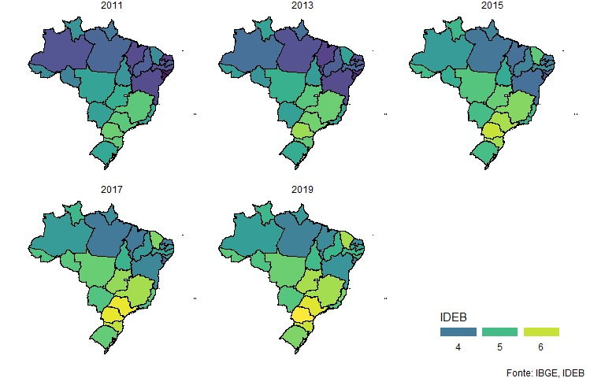

```{r Bibliotecas, results='hide', echo=FALSE, warning=FALSE, message=FALSE}
# Gráficos e Tabelas

library(ggplot2)
library(stargazer)
library(kableExtra)
library(patchwork)
library(viridis)

# Dados
library(magrittr)
library(tidyverse)
library(readxl)
library(janitor)
library(psych)

# Modelos
library(plm)

# Testes e erros-padrões
library(robustbase)
library(lmtest)

# Loop
library(purrr)
```

```{r Setup, results='hide', echo=FALSE, warning=FALSE, message=FALSE}
## Comandos Úteis
# Apagar Variáveis
rm(list = ls())
# Limpar Console
cat("\014")

# Mais informações: JuntaBasesEducacao.R
# Diretório
setwd(dirname(rstudioapi::getActiveDocumentContext()$path))
sDiretorio_Base <- dirname(rstudioapi::getActiveDocumentContext()$path)

# Definindo pasta de dados 
sPasta_Dados <- paste(sDiretorio_Base, "Dados", sep = "/")

# Nome do arquivo
sArquivo_Dados <- "Dados_Educacao_Final.csv"

# PASTA DE DADOS: https://drive.google.com/drive/folders/1_IVjxQCluX9JYeL3RMlah60Elew0tSjW?usp=sharing
  # Salvar o arquivo resultante desse script ("Dados_Educacao_Final.csv") em uma pasta chamada "Dados" no mesmo diretório do arquivo Markdown para debugar o notebook :)
```

```{r Setup_Figuras, echo=FALSE, results='hide', message=FALSE, warning=FALSE}
## Alinhando figuras ao centro e definindo tamanho
knitr::opts_chunk$set(fig.align = 'center', echo = TRUE)
knitr::opts_chunk$set(fig.width = 5, fig.height = 3) 

## Pegando função que plotta coeficientes (plot_coeficientes)
source(paste(sDiretorio_Base, "/Aux/plot_coeficientes.R", sep=""))
source(paste(sDiretorio_Base, '/Aux/longtable_stargazer.R', sep=''))
```

```{r Leitura da Base, results='hide', echo=FALSE, warning=FALSE, message=FALSE, cache = TRUE}
# Lendo a base
df <- read_csv(paste(sPasta_Dados, sArquivo_Dados, sep = "/"))

# Capitalizando nomes de rede e anos_escolares
df$rede <- str_to_title(df$rede)

# Mudando nome das etapas escolares
df$anos_escolares <- ifelse(df$anos_escolares == "finais (6-9)",
                            "Fundamental II",
                            "Fundamental I")
```

\newpage
# Introdução {#introducao}

Até meados do século XX, a educação básica no Brasil foi um privilégio restrito às camadas sociais economicamente mais beneficiadas, o que colocava o país entre os territórios com os piores indicadores tanto em termos de nível quanto de desigualdade escolar [@desigualdade_educacao] [@lopez2010declining].
A partir de 1970, porém, houve um grande salto quantitativo, elevando a dispersão e a média educacional do país [@vanLeeuwen2015], o que causou, por exemplo, um ganho de produtividade e uma redução da desigualdade de renda [@barros2010markets].

Nesse sentido, a figura abaixo mostra a trajetória temporal da escolaridade média do Brasil e sua grande evolução ao longo das últimas décadas.
Os dados são de @vanLeeuwen2015 e as linhas cinzas representam os diversos outros países da amostra:

```{r Evolução Escolaridade, fig.cap="Escolaridade Média de Diversos Países entre 1900 e 2010", echo=F, message=F, warning=F, cache=TRUE}
# Lendo os dados de anos de educação
dfAnosEducacao <- readxl::read_excel("Dados/AverageYearsofEducation_Compact.xlsx",
                                     sheet = "Data Long Format")

# Dados do Brasil
dfAnosEducacaoBR <- dfAnosEducacao %>% 
  filter(country.name == "Brazil", year >= 1900)

# Gráfico com linhas cinzas e Brasil destacado
dfAnosEducacao %>% 
  filter(year >= 1900) %>% 
  ggplot(aes(x = year, y = value, group = country.name)) +
  geom_line(lwd = .5, colour = "lightgray") +
  # Brasil
  geom_point(data = dfAnosEducacaoBR, size = 2.5, colour = "brown1") + 
  geom_line(data = dfAnosEducacaoBR, lwd = 1.25, colour = "brown1") +
  scale_x_continuous(breaks = seq(1900, 2010, by = 10)) +
  scale_y_continuous(breaks = seq(0, 14, by = 2),
                     labels=function(x) format(x, big.mark = ".", decimal.mark = ",", scientific = F)) +
  labs(x = "Ano", y = "Anos de Educação") + 
  theme_bw() +
  theme(plot.margin=unit(c(0,0,0,0), "null")) +  # remover espaços em branco ao redor do plot
  theme(legend.position = 'none')
```


O século XXI trouxe consigo o desafio de aliar esse ganho quantitativo a melhoras qualitativas na educação, especialmente nas etapas mais básicas.
Assim, indicadores sintéticos de performance escolar tornaram-se fundamentais para avaliar a qualidade do ensino brasileiro e melhor direcionar as políticas públicas nesta área, além de permitirem comparações mais acuradas entre diferentes períodos e localidades [@determinantes_ideb_data_science].

Nesse sentido, criou-se, em 2007, o Índice de Desenvolvimento da Educação Básica (IDEB).
Ele reúne em um indicador duas medidas de qualidade da educação: o fluxo escolar -- medido pela taxa de aprovação dos alunos -- e as médias de desempenho em avaliações nacionais -- que são uma *proxy* para o grau de aprendizagem.
No ano de sua concepção, a meta era alcançar uma média nacional de 6 pontos (em uma escala que vai de 0 a 10) no IDEB até 2021, o que, apesar de pequenos avanços no passado recente, parece um sonho distante [@ocde_outlook].

Vários fatores estão correlacionados com a performance acadêmica e contribuem para o desempenho subótimo do país, como os altos níveis de pobreza e desigualdade [@duarte2013impacto]; os gastos em educação relativamente pequenos em relação ao PIB [@gregorio_nexo]; e a baixa qualidade do valor investido por aluno, especialmente em casos como o do Brasil em que tal despesa já não é tão baixa [@duque_nexo].
Ressalta-se, porém, que não há consenso no que tange ao impacto desses fatores, sendo que há inclusive uma heterogeneidade no que tange às variáveis mais importantes para a predição do IDEB a depender do etapa educacional (Ensino Fundamental I, Fundamental II ou Médio) [@determinantes_ideb_data_science].

Faltam, porém, estudos acerca do papel de características de infraestrutura e de tecnologia dos colégios sobre o desempenho medido pelo IDEB que, apesar de correlacionadas com o nível socioeconômico da escola [@educacao_guia_dados], ainda são variáveis fundamentais de serem analisadas e importantes para o aprendizado.
Além disso, @gregorio_nexo mostra que, mesmo em anos recentes, a boa infraestrutura escolar está longe de ser universalizada no Brasil, especialmente no que tange às redes municipais e estaduais, as quais concentram a maior parte das matrículas do ensino básico brasileiro.
Ademais, o autor também mostra que, em 2015, 69% das redes de ensino investiam, por aluno, um valor inferior à média nacional, o que se traduz em grandes deficiências estruturais.

Nesse sentido, o presente trabalho tem por objetivo analisar justamente o efeito das variáveis de infraestrutura sobre o desempenho acadêmico e a aprendizagem da rede mais numerosa e deficitária do país: a municipal.
Em especial, o foco da pesquisa será o desempenho nas duas etapas da educação básica, ou seja, o IDEB do Ensino Fundamental I (\enquote{Anos Iniciais}) e II (\enquote{Anos Finais}).
Para isso, foram extraídos dados de diversas fontes educacionais e socioeconômicas entre 2009 e 2019 ao nível de escola e de município, visando aferir, por meio de análises descritivas, regressões e modelos de painel, o impacto de melhoras na infraestrutura escolar sobre a performance educacional dos estudantes medida/estimada pelo IDEB.


# O IDEB {#ideb}

Criado em 2007 para estimar a situação educacional do país, o IDEB é calculado bianualmente, haja vista a periodicidade das provas que o compõem.
Além disso, o índice faz parte de uma das principais metas do Plano de Desenvolvimento da Educação (PDE), sendo que o objetivo nacional era alcançar uma média de 6 pontos -- o que seria compatível com o patamar de países considerados desenvolvidos -- no IDEB 2021, a ser divulgado em 2022, ano do bicentenário da Independência [@ideb_inconsistencias_cavalos].

Como brevemente comentado na [**Introdução**](#introducao), o índice é construído a partir da multiplicação de duas medidas:

- O *indicador de rendimento* ($R$), construído com base na taxa de aprovação dos alunos da escola. 
Dessa forma, essa métrica mede o fluxo dos estudantes a partir de uma avaliação *interna*, ou seja, feita pela própria instituição;
- A *média do desempenho em provas* ($A$) de matemática e português^[A nível nacional e estadual, é aplicada a prova do Sistema de Avaliação da Educação Básica (Saeb). Para os municípios, a métrica é construída com base nos resultados da Prova Brasil.].
Assim, esse índice busca aproximar o desempenho acadêmico a partir de uma avaliação *externa*, ou seja, montada pelo Inep e aplicada em larga escala.

Simplificadamente, o IDEB pode ser calculado pela seguinte expressão^[Mais detalhes podem ser vistos na nota técnica de concepção do IDEB, disponível [aqui](https://download.inep.gov.br/educacao_basica/portal_ideb/o_que_e_o_ideb/Nota_Tecnica_n1_concepcaoIDEB.pdf).]:

\begin{equation}
  \text{IDEB} = R \cdot A
\end{equation}

A construção do índice a partir da combinação entre \enquote{fluxo} e \enquote{aprendizagem} tem por objetivo equilibrar a avaliação do indicador, desincentivando, por exemplo, os gestores a reprovarem seus estudantes para que alcancem resultados melhores nas provas posteriormente.
Analogamente, uma alta taxa de aprovação sem aprendizado levaria a resultados piores nas avaliações externas, o que também seria captado pela métrica [@inep_ideb].

Contudo, o índice possui também muitas críticas, as quais foram compiladas e estendidas por @ideb_inconsistencias_cavalos.
No texto, os autores pontuam que, uma vez que o índice só é anonimizado para os alunos e a abordagem da divulgação de seus resultados -- que, em termos de transparência, é considerada um ponto positivo -- está centrada no ranqueamento das escolas, as instituições possuem incentivos a burlarem alguns dos pressupostos da avaliação.
Dessa forma, colégios preparam ativamente seus estudantes com questões de provas antigas e simulados, bem como deixam de aplicar a avaliação para aqueles considerados menos bem preparados.

A não-aplicação da prova pode ser combinada com uma política de alta taxa interna de aprovação, o que eleva artificialmente o índice da escola e pode representar um erro de medida na variável dependente dos modelos usados.
Ademais, os autores também encontram que, em alguns estados, não há correspondência entre as notas do IDEB nas diferentes etapas do Ensino Fundamental, bem como entre a métrica do Ensino Médio e as notas do ENEM.

Por fim, por mais que uma avaliação externa de larga escala traga consigo benefícios relacionados à possibilidade de comparação entre períodos e regiões, a prova desconsidera questões qualitativas, socioeconômicas e conjunturais que podem vir a afetar o desempenho dos estudantes.
É precisamente esse aspecto que o presente trabalho busca analisar, visando, a partir dos dados descritos na seção a seguir, estimar o impacto de melhoras na estrutura escolar sobre o desempenho acadêmico dos alunos.


# Dados {#dados}

Como dito anteriormente, este trabalho tem como objetivo principal analisar o desempenho das escolas municipais nas duas etapas que compõe a educação básica, o qual pode ser medido através do IDEB e dos índices que o compõe. 
Contudo, usou-se também uma série de outras características escolares e municipais a fim de se determinar os impactos *ceteris paribus* das variáveis de infraestrutura sobre a performance acadêmica das instituições de ensino.
Apesar de serem de diferentes fontes, todos os dados foram extraídas do *datalake* da Base dos Dados [@base_dos_dados] usando o *Google Big Query*^[As *queries* usadas estão disponíveis no arquivo `.Dados/Queries_LabEconometria.sql`.].

No que tange ao [IDEB](https://basedosdados.org/dataset/br-inep-IDEB), foram usados os dados disponibilizados pelo Instituto Nacional de Estudos e Pesquisas Educacionais Anísio Teixeira (Inep) a nível escolar e municipal.
Assim, foram excluídas as escolas municipais brasileiras que não possuíam IDEB registrado, o que pode ocorrer por um número insuficiente de alunos realizando a Prova Brasil ou por falta de prestação de informação por parte da escola [@inep_nota_faltantes].
Como há pouquíssimos colégios municipais de Ensino Médio e os microdados escolares do IDEB a cerca dessa etapa só passaram a ser divulgados em 2017, a análise será centrada no Ensino Fundamental.

Para as variáveis de infraestrutura, tecnologia, número de matrículas e quantidade professores, usou-se o [Censo Escolar](https://basedosdados.org/dataset/br-inep-censo-escolar), também disponibilizado pelo Inep.
As características de infraestrutura e tecnologia foram obtidas ao nível do colégio; o número de alunos e docentes, por sua vez, foi obtido agrupando as respectivas tabelas por `id_escola` e `ano`.
Por fim, usou-se os dados dos [Indicadores Educacionais](https://basedosdados.org/dataset/br-inep-indicadores-educacionais) do Inep para obter a média de alunos por turma, a quantidade de horas-aula e o percentual de professores com ensino superior em cada uma das etapas de ensino (Fundamental I e II) em cada escola.

Além disso, o @tesouro chama a atenção para a correlação entre o desempenho no IDEB e as despesas municipais em educação por aluno; mais especificamente, uma *proxy* para o valor gasto por escola.
Visando captar essa relação, foram coletados também dados do Sistema de Informações Contábeis e Fiscais do Setor Público Brasileiro ([SICONFI](https://basedosdados.org/dataset/br-me-siconfi)) a fim de se obter o valor das despesas com educação^[Para o cálculo, considerou-se as Despesas Empenhadas e ambas as categorias de Inscrições de Resto a Pagar.] de cada município.

Assim, sendo $desp_{educ}^{mun}$ a despesa do município com educação, $alunos^{mun}$ o número de matrículas do município -- obtido por meio da agregação do número de matrículas do Censo Escolar ao nível municipal -- e o superescrito $^{esc}$ indicando suas contrapartidas ao nível escolar, a *proxy* para o valor gasto por cada escola usada pelo Tesouro Nacional pode ser obtido pela seguinte expressão:

\begin{equation}
  desp_{educ}^{esc} = \frac{alunos^{esc}}{alunos^{mun}} \cdot desp_{educ}^{mun}
\end{equation}

Também foram utilizados os dados disponibilizados pelo Instituto Brasileiro de Geografia e Estatística (IBGE) para a obtenção de informações acerca do [PIB](https://basedosdados.org/dataset/br-ibge-pib) e da [população](https://basedosdados.org/dataset/br-ibge-populacao) municipal.
Assim, foi possível criar variáveis de despesas com educação frente ao PIB do município -- o que indica a \enquote{disposição} da cidade a investir em educação -- e também em termos per capita.

Ademais, as variáveis de gastos municipais com educação e PIB foram todas trazidas para Reais do início de 2019, a fim de permitir melhores comparações nas análises descritivas.
Para a primeira, foi construída uma tabela de índice de preços com base nos valores de produção do produto \enquote{Educação Pública} nas Tabelas de Recursos e Usos (TRUs) retropoladas.
Já a segunda, por sua vez, foi deflacionada usando o deflator implícito do PIB nacional.

Na base de dados também foram incluídos os dados acerca das transferências do Governo Federal aos municípios pelo Fundo Nacional da Educação Básica ([FUNDEB](http://www.tesourotransparente.gov.br/ckan/dataset/transferencias-obrigatorias-da-uniao-por-municipio)).
O uso dessa variável tem por objetivo avaliar e controlar para a razão entre tais transferências e os gastos totais com educação de cada município, visando analisar a dependência do orçamento educacional das cidades frente aos recursos federais.

Por fim, usou-se a Relação Anual de Informações Sociais ([RAIS](https://basedosdados.org/dataset/br-me-rais)) para se obter o número de trabalhadores formais e o salário médio (em reais correntes e em relação ao salário mínimo do respectivo ano) de cada município.
Além disso, coletou-se também esses dados discriminados para os professores de cada etapa educacional relevante: Fundamental I (família 2312) e II (2313), fazendo-se a razão desses rendimentos frente ao salário médio do município.
Ressalta-se, porém, que essas informações detalhadas da RAIS são esparsas nos anos iniciais da base e podem apresentar inconsistências com, por exemplo, o número de professores registrado no Censo Escolar.

Com a junção de todas as bases -- o que foi feito a partir dos dados do IDEB e por meio de *inner joins*^[
As variáveis usadas para os *joins* foram as de `ano`, `id_escola`, `id_municipio` e `uf`, a depender das bases a serem fundidas.
]
a fim de maximizar a quantidade de informações --, obteve-se uma tabela com 271.621 observações e 99 variáveis distribuídas bianualmente entre 2009 e 2019, uma vez que as avaliações acontecem de dois em dois anos.

Contudo, verificou-se alguns valores extremos no que tange às despesas com educação em alguns municípios, o que afeta também o cálculo da *proxy* proposta para os colégios.
Dessa forma, considerou-se como *outliers* as observações com um gasto em educação per capita ou com uma *proxy* para a despesa das escolas que estavam nos 0,1% do topo ou da cauda da respectiva distribuição, o que resultou em uma eliminação de pouco menos de 1.000 observações do universo inicial, chegando a 270.660 colégios.

A distribuição das informações por ano e etapa escolar pode ser vista na Tabela \ref{tab:dist_anos_etapa} abaixo, na qual se pode ver a consistência numérica das informações do Ensino Fundamental ao longo do tempo.
Por fim, ressalta-se que todas as escolas com IDEB registrado possuem informações acerca de sua estrutura e tecnologia no Censo Escolar desde 2009, o que será útil ao presente trabalho.

```{r Distribuição das Observações, results='asis', echo=FALSE, warning=FALSE, message=FALSE, cache = TRUE}
# Criando uma tabela com as observações por ano e etapa escolar com o stargazer
# Importante: results='asis' para renderizar de forma correta
df %>% 
  group_by(ano, anos_escolares) %>% 
  summarise(n = n()) %>% 
  pivot_wider(names_from = anos_escolares, values_from = n, values_fill = 0) %>% 
  rename(Ano = ano) %>% 
  mutate(Total = `Fundamental I` + `Fundamental II`) %>% 
  adorn_totals("row") %>% 
  stargazer(
    title = "Distribuição das Observações por Ano e Etapa Escolar",
    summary = F, rownames = F, header = F,
    digit.separator = ".", label = "tab:dist_anos_etapa"
  )
```


\newpage
# Análises Descritivas

Feita a introdução sobre os dados, é importante a realização de uma análise descritiva a fim de ver as principais relações entre o IDEB e as características de infraestrutura, além de eventuais diferenças regionais no desempenho acadêmico.
Assim, serão analisados diversos gráficos acerca da evolução temporal do IDEB, bem como de sua distribuição condicional em outras variáveis.

A análise de infraestrutura irá focar nos efeitos do provimento de energia, água, internet, esgoto sobre a performance acadêmica dos estudantes das duas etapas do Ensino Fundamental, além de outras questões estruturais.
Além disso, o tópico regional avaliará os índices de desempenho escolar dos alunos para cada uma das cinco regiões do Brasil, com o intuito de captar diferenças sistemáticas entre as regiões, as quais parecem ser persistentes no tempo [@desigualdade_educacao].

Antes de começar as análises de infraestrutura, é importante observar como se deu a evolução do IDEB e de seus componentes ao longo do tempo, separando a visualização por etapa escolar a fim de se verificar eventuais diferenças na evolução e no nível de aprendizado de estudantes de diferentes idades.
Nele, vê-se que a evolução de ambas as etapas é similar, mas o IDEB do Ensino Fundamental I é superior àquele visto nos Anos Finais.
Além disso, vê-se que o *gap* entre Anos Iniciais e Finais é maior no que tange à aprendizagem  -- aproximada pelo SAEB --, o que é compensado por uma menor diferença no Índice de Rendimento.
De fato, parece haver um *trade-off* entre proficiência e aprovação [@zoghbi2011analise].

```{r Evolucao_IDEB_SAEB, fig.cap="Evolução do IDEB e dos seus Componentes por Etapa Escolar", echo=F, message=F, warning=F, fig.width=7, fig.height=2.5, cache=TRUE}
# Gráfico de linhas com a média do IDEB ao longo do tempo por etapa escolar
## IDEB
grafIDEB <- df %>% 
  group_by(ano, rede, anos_escolares) %>% 
  summarise(ideb = mean(ideb)) %>% 
  ggplot(aes(x = factor(ano), y = ideb, colour = anos_escolares, group = anos_escolares)) +
  geom_point(size = 2.5) + 
  geom_line(lwd = 1.25) +
  labs(x = "Ano", y = "IDEB") +
  guides(colour = guide_legend("Anos Escolares"), fill = 'none') +
  scale_y_continuous(labels=function(x) format(x, big.mark = ".", decimal.mark = ",", scientific = F)) +
  theme_bw() +
  theme(legend.position = 'top', plot.margin=unit(c(0,0,0,0), "null"),
        axis.title=element_text(size=8))

## SAEB
grafSAEB <- df %>% 
  group_by(ano, rede, anos_escolares) %>% 
  summarise(saeb = mean(saeb_ideb)) %>% 
  ggplot(aes(x = factor(ano), y = saeb, colour = anos_escolares, group = anos_escolares)) +
  geom_point(size = 2.5) + 
  geom_line(lwd = 1.25) +
  labs(x = "Ano", y = "SAEB") +
  guides(colour = guide_legend("Anos Escolares"), fill = 'none') +
  scale_y_continuous(labels=function(x) format(x, big.mark = ".", decimal.mark = ",", scientific = F)) +
  theme_bw() + 
  theme(legend.position = 'top', plot.margin=unit(c(0,0,0,0), "null"),
        axis.title=element_text(size=8))

## Índice de Rendimento (Taxa de Aprovação)
grafRendimento <- df %>% 
  group_by(ano, rede, anos_escolares) %>% 
  summarise(rendimento = mean(rendimento_aprovacao_ideb)) %>% 
  ggplot(aes(x = factor(ano), y = 100*rendimento, colour = anos_escolares, group = anos_escolares)) +
  geom_point(size = 2.5) + 
  geom_line(lwd = 1.25) +
  labs(x = "Ano", y = "Índice de Rendimento (%)") +
  guides(colour = guide_legend("Anos Escolares"), fill = 'none') +
  scale_y_continuous(labels=function(x) format(x, big.mark = ".", decimal.mark = ",", scientific = F)) +
  theme_bw() + 
  theme(legend.position = 'top', plot.margin=unit(c(0,0,0,0), "null"),
        axis.title=element_text(size=8))

# Juntando tudo
juntos <- grafIDEB + 
  grafSAEB + 
  grafRendimento +
  plot_layout(guides = "collect") & theme(legend.position = 'top')

# Exibindo
juntos
```


## Infraestrutura

Felizmente, as características de infraestrutura têm caminhado rumo à universalização ao longo do tempo, mesmo entre as escolas municipais, as quais, geralmente, costumam receber menos recursos.
A porcentagem de colégios que possuem as principais características de infraestrutura pode ser vista na tabela abaixo^[
Na tabela abaixo e ao longo do documento, \enquote{RP} significa que a infraestrutura é ligada à rede pública de energia/água.], na qual se vê a ubiquidade do acesso à água, energia e esgoto, bem como a crescente disponibilidade de internet^[
Algumas das variações contraintuitivas na tabela podem ser fruto de (1) mudança amostral (2) erros de declaração, uma vez que o Censo Escolar é autodeclarado.]:

```{r Médias de Infraestrutura, results='asis', echo=FALSE, warning=FALSE, message=FALSE, cache = TRUE}
df %>% 
  rename(Ano = ano) %>% 
  group_by(Ano) %>% 
  summarise(`Água` = mean(est_agua),
            `Água RP` = mean(est_agua_rede_publica),
            `Energia` = mean(est_energia),
            `Esgoto` = mean(est_esgoto),
            `Internet` = mean(tec_internet),
            # `Quadras` = mean(est_quadraesportes),  # tirar? falta de dados!
            `Lab. Informática` = mean(tec_lab_informatica),
            `Biblioteca` = mean(est_biblioteca)) %>% 
  mutate(across(!c(Ano), ~scales::percent(., accuracy = .1, decimal.mark = ","))) %>% 
  stargazer(
      title = "Médias de Infraestrutura por Ano",
      summary = F, rownames = F, header = F,
      digit.separator = ".", label = "tab:infraestrutura_ano"
    )
```

### Energia

No que diz respeito aos efeitos do provimento de energia para as escolas sobre o IDEB, é possível inferir dos boxplots e das densidades condicionais abaixo que os estudantes de instituições que desfrutam de energia elétrica tendem a ter um desempenho superior àqueles que frequentam colégios sem energia. 
Tal conclusão é baseada no fato de que a distribuição das escolas com energia (curva em azul) está a direita daquela dos colégios que não tem eletricidade (em vermelho).
No gráfico de boxplot, por sua vez, vê-se que a distribuição das escolas com energia é superior àquela de suas contrapartidas, além de possuir uma maior variância.

Por fim, o gráfico de linhas mostra que há um grande hiato nas médias do IDEB entre as escolas com e sem energia.
Mais ainda, vê-se que essa diferença vem aumentando ao longo do tempo -- com os IDEBs de colégios com eletricidade crescendo e os de sem energia com um histórico volátil -- e é maior no Ensino Fundamental I, o que indica que crianças em idades iniciais de alfabetização sofrem mais com a carência de recursos.

```{r Densidade Energia, fig.cap="Densidade do IDEB por Energia", echo=F, message=F, warning=F, fig.height=2, fig.width=4, cache=TRUE}
## Gráfico de densidade
df %>% 
  mutate(ano = factor(ano), est_energia = factor(est_energia)) %>% 
  ggplot(aes(x = ideb, fill = est_energia, colour = est_energia)) +
  geom_density(alpha = .1, show.legend = F) + 
  stat_density(geom="line",position="identity") +
  labs(x = "IDEB", y = "Densidade") +
  scale_x_continuous(labels=function(x) format(x, big.mark = ".", decimal.mark = ",", scientific = FALSE)) +
  scale_y_continuous(labels=function(x) format(x, big.mark = ".", decimal.mark = ",", scientific = FALSE)) +
  scale_color_hue(labels = c("Não", "Sim")) +
  theme_bw() +
  theme(legend.position = 'top', plot.margin=unit(c(0,0,0,0), "null")) +
  guides(colour = guide_legend("Energia"), fill = 'none')
```

```{r Boxplot Energia, fig.cap="Boxplot do IDEB por Ano e Fornecimento de Energia", echo=F, message=F, warning=F, cache=TRUE}
## Boxplot
df %>% 
  mutate(ano = factor(ano), est_energia = factor(est_energia)) %>% 
  ggplot(aes(x = ano, y = ideb, fill = est_energia)) +
  geom_boxplot() + 
  labs(x = "Ano", y = "IDEB") +
  scale_fill_hue(labels = c("Não", "Sim")) +
  theme_bw() +
  theme(legend.position = 'top', plot.margin=unit(c(0,0,0,0), "null")) +
  guides(fill = guide_legend("Energia"))
```

```{r Linhas Energia, echo=F, fig.cap="Evolução do IDEB por Ano e Fornecimento de Energia", message=FALSE, warning=FALSE, cache=TRUE}
## Gráfico de linhas
df %>% 
  group_by(ano, est_energia, anos_escolares) %>% 
  summarise(ideb = mean(ideb)) %>% 
  ggplot(aes(x = factor(ano), y = ideb, 
             colour = factor(est_energia), 
             group = factor(est_energia))) +
  geom_point(size = 2.5) + 
  geom_line(lwd = 1.25) +
  labs(x = "Ano", y = "IDEB") +
  scale_y_continuous(breaks = seq(3, 5.5, by = .5),
                     labels=function(x) format(x, big.mark = ".", decimal.mark = ",", scientific = F)) +
  scale_color_hue(labels = c("Não", "Sim")) +
  theme_bw() + 
  guides(colour = guide_legend("Energia")) +
  theme(legend.position = 'top', plot.margin=unit(c(0,0,0,0), "null")) +
  facet_grid(cols = vars(anos_escolares), switch = 'y')
```


### Água e Água Fornecida pela Rede Pública

Em relação aos efeitos do provimento de água, é possível inferir do gráfico de violino abaixo -- uma variação de um boxplot que mostra a densidade relativa dos dados -- que a concentração de escolas com água se situa em valores de IDEB superiores àqueles observados para a concentração dos colégios sem água.
A espessura dos violinos mostra também que as notas de instituições sem fornecimento de água são mais concentradas na cauda da distribuição, ao passo que a dispersão de colégios com água é mais uniforme.

```{r Violino Água, fig.cap="Distribuição do IDEB por Fornecimento de Água", echo=F, message=F, warning=F, cache=TRUE}
## Violin
df %>% 
  mutate(ano = factor(ano), est_agua = factor(est_agua)) %>% 
  ggplot(aes(x = ano, y = ideb, fill = est_agua)) +
  geom_violin(draw_quantiles = c(0.5)) + 
  labs(x = "Ano", y = "IDEB") +
  scale_fill_hue(labels = c("Não", "Sim")) +
  theme_bw() +
  theme(legend.position = 'top', plot.margin=unit(c(0,0,0,0), "null")) +
  guides(fill = guide_legend("Água"))
```

A importância do provimento de água para as escolas é reforçada quando se analisa o provimento público de água, uma vez que alguns colégios podem ser abastecidos por caminhões pipa ou por poços artesianos, por exemplo. 
Segundo o gráfico apresentado a seguir, a média do IDEB das escolas com fornecimento público de água é maior em ambos os anos e tanto no Ensino Fundamental I quanto no II, sendo que a diferença é maior naquela etapa frente a esta -- mesma conclusão que foi encontrada na análise de energia.
Ao contrário da subseção anterior, porém, esse hiato parece estar relativamente constante ao longo do tempo.

```{r Linhas Água Pública, fig.cap="Evolução do IDEB por Ano e Fornecimento Público de Água", echo=F, message=F, warning=F, cache=TRUE}
## Gráfico de linhas
df %>% 
  group_by(ano, est_agua_rede_publica, anos_escolares) %>% 
  summarise(ideb = mean(ideb)) %>% 
  ggplot(aes(x = factor(ano), y = ideb, 
             colour = factor(est_agua_rede_publica), 
             group = factor(est_agua_rede_publica))) +
  geom_point(size = 2.5) + 
  geom_line(lwd = 1.25) +
  labs(x = "Ano", y = "IDEB") +
  scale_y_continuous(breaks = seq(3, 5.5, by = .5),
                     labels=function(x) format(x, big.mark = ".", decimal.mark = ",", scientific = F)) +
  scale_color_hue(labels = c("Não", "Sim")) +
  theme_bw() + 
  theme(legend.position = 'top', plot.margin=unit(c(0,0,0,0), "null")) + 
  guides(colour = guide_legend("Fornecimento Público de Água")) +
  facet_grid(cols = vars(anos_escolares), switch = 'y')
```

### Esgoto

O sistema de esgoto é outro componente estrutural que também influi sobre o desempenho escolar dos estudantes, pois sua presença indica a qualidade do saneamento de uma escola. 
Tal fato é corroborado não só pelas informações providas pelo gráfico a seguir, mas também por seus efeitos positivos sobre o desempenho dos estudantes, o que já foi documento por vários estudos a respeito do tema [@esgoto_educacao].
Novamente, a diferença parece ser maior nos anos iniciais da alfabetização, sendo também relativamente constante ao longo do tempo:

```{r Linhas Esgoto, fig.cap="Evolução do IDEB por Ano e Fornecimento Público de Água", echo=F, message=F, warning=F, cache=TRUE}
## Gráfico de linhas
df %>% 
  group_by(ano, est_esgoto, anos_escolares) %>% 
  summarise(ideb = mean(ideb)) %>% 
  ggplot(aes(x = factor(ano), y = ideb, 
             colour = factor(est_esgoto), 
             group = factor(est_esgoto))) +
  geom_point(size = 2.5) + 
  geom_line(lwd = 1.25) +
  labs(x = "Ano", y = "IDEB") +
  scale_y_continuous(breaks = seq(3, 5.5, by = .5),
                     labels=function(x) format(x, big.mark = ".", decimal.mark = ",", scientific = F)) +
  scale_color_hue(labels = c("Não", "Sim")) +
  theme_bw() + 
  theme(legend.position = 'top', plot.margin=unit(c(0,0,0,0), "null")) + 
  guides(colour = guide_legend("Esgoto")) +
  facet_grid(cols = vars(anos_escolares), switch = 'y')
```

### Internet

Como visto na tabela inicial dessa seção, uma parcela crescente das escolas municipais têm disponibilizado internet aos seus alunos, visando acompanhar a transformação digital que, inevitavelmente, afeta os métodos de aprendizado dos estudantes.
Dessa forma, espera-se que a diferença de rendimento entre os estudantes com e sem acesso aos meios digitais cresça ao longo do tempo.

De fato, o gráfico de linhas abaixo mostra que isso é verdade em ambas as etapas escolares, sendo que o hiato aumentou cerca de 50% tanto no Ensino Fundamental I quanto no II.
Novamente, tanto o nível quanto a diferença são maiores nos Anos Iniciais, o que corrobora a hipótese já desenvolvida nas subseções anteriores da maior importância de infraestrutura para a boa alfabetização.
Tal fato é justificado pela importância atribuída a presença da internet para os estudantes, sobretudo como instrumento de pesquisa [@Oliveira_Casagrande_Galerani_2016] tendo em vista a facilidade e praticidade para obter informações nos meios virtuais.

```{r Linhas Internet, fig.cap="Evolução do IDEB por Ano e Acesso à Internet", echo=F, message=F, warning=F, cache=TRUE}
## Gráfico de linhas
df %>% 
  group_by(ano, tec_internet, anos_escolares) %>% 
  summarise(ideb = mean(ideb)) %>% 
  ggplot(aes(x = factor(ano), y = ideb, 
             colour = factor(tec_internet), 
             group = factor(tec_internet))) +
  geom_point(size = 2.5) + 
  geom_line(lwd = 1.25) +
  labs(x = "Ano", y = "IDEB") +
  scale_y_continuous(breaks = seq(3, 5.5, by = .5),
                     labels=function(x) format(x, big.mark = ".", decimal.mark = ",", scientific = F)) +
  scale_color_hue(labels = c("Não", "Sim")) +
  theme_bw() + 
  theme(legend.position = 'top', plot.margin=unit(c(0,0,0,0), "null")) + 
  guides(colour = guide_legend("Internet")) +
  facet_grid(cols = vars(anos_escolares), switch = 'y')
```

```{r Violino Internet, fig.cap="Distribuição do IDEB por Acesso à Internet", echo=F, message=F, warning=F, cache=TRUE}
## Gráfico de violino
df %>% 
  mutate(ano = factor(ano), tec_internet = factor(tec_internet)) %>% 
  ggplot(aes(x = ano, y = ideb, fill = tec_internet)) +
  geom_violin(draw_quantiles = c(0.5)) + 
  labs(x = "Ano", y = "IDEB") +
  scale_fill_hue(labels = c("Não", "Sim")) +
  theme_bw() +
  theme(legend.position = 'top', plot.margin=unit(c(0,0,0,0), "null")) + 
  guides(fill = guide_legend("Internet"))
```


### Quadras de Esporte

Outro fator estrutural que contribui para o bom do desempenho dos estudantes é a presença de quadras de esporte, uma vez que a prática de atividades desportivas contribui positivamente para o rendimento dos alunos [@esporte_educacao]. 
A análise do gráfico corrobora o fato acima, uma vez que colégios com quadras possuem IDEBs sistematicamente maiores que suas contrapartidas; ressalta-se, contudo, um problema na declaração dessa variável em 2011 e 2013, anos nos quais não há nenhuma instituição com quadra reportada.

```{r Linhas Quadras, fig.cap="Evolução do IDEB por Ano e Existência de Quadras Esportidas", fig.align = 'center', echo=F, message=F, warning=F, cache=TRUE}
## Gráfico de Linhas
df %>% 
  group_by(ano, est_quadraesportes, anos_escolares) %>% 
  summarise(ideb = mean(ideb)) %>% 
  ggplot(aes(x = factor(ano), y = ideb, 
             colour = factor(est_quadraesportes), 
             group = factor(est_quadraesportes))) +
  geom_point(size = 2.5) + 
  geom_line(lwd = 1.25) +
  labs(x = "Ano", y = "IDEB") +
  scale_y_continuous(breaks = seq(3, 5.5, by = .5),
                     labels=function(x) format(x, big.mark = ".", decimal.mark = ",", scientific = F)) +
  scale_color_hue(labels = c("Não", "Sim")) +
  theme_bw() + 
  theme(legend.position = 'top', plot.margin=unit(c(0,0,0,0), "null")) + 
  guides(colour = guide_legend("Quadra de Esportes")) +
  facet_grid(cols = vars(anos_escolares), switch = 'y')
```


### Laboratório de Informática

No que diz respeito ao laboratório de informática, pode-se dizer que a sua presença em instituições de ensino também é importante para o rendimento escolar dos estudantes, pois é uma estrutura que complementa as benesses providas pela internet. 
Tais fatos são corroborados pelas informações do gráfico a seguir, o qual aponta para uma correlação positiva entre a presença de laboratórios de informática e o desempenho da escola:

```{r Linhas Lab., fig.cap="Evolução do IDEB por Ano e Acesso a Laboratório de Informática", echo=F, message=F, warning=F, fig.height=2.5, cache=TRUE}
## Gráficos de linhas
df %>% 
  group_by(ano, tec_lab_informatica, anos_escolares) %>% 
  summarise(ideb = mean(ideb)) %>% 
  ggplot(aes(x = factor(ano), y = ideb, 
             colour = factor(tec_lab_informatica), 
             group = factor(tec_lab_informatica))) +
  geom_point(size = 2.5) + 
  geom_line(lwd = 1.25) +
  labs(x = "Ano", y = "IDEB") +
  scale_y_continuous(breaks = seq(3, 5.5, by = .5),
                     labels=function(x) format(x, big.mark = ".", decimal.mark = ",", scientific = F)) +
  scale_color_hue(labels = c("Não", "Sim")) +
  theme_bw() + 
  theme(legend.position = 'top', plot.margin=unit(c(0,0,0,0), "null")) + 
  guides(colour = guide_legend("Laboratório de Informática")) +
  facet_grid(cols = vars(anos_escolares), switch = 'y')
```


### Biblioteca

Por último, vale destacar a importância das bibliotecas no ambiente escolar como um componente estrutural que visa o incentivo ao estudo e à leitura. 
No gráfico a seguir, como era de esperar, nota-se a relação positiva entre a presença de bibliotecas e os valores de IDEB das instituições que contam com essa estrutura específica.

```{r Linhas Biblioteca, fig.cap="Evolução do IDEB por Ano e Acesso a Biblioteca", echo=F, message=F, warning=F, fig.height=2, cache=TRUE}
## Gráfico de linhas
df %>% 
  group_by(ano, est_biblioteca, anos_escolares) %>% 
  summarise(ideb = mean(ideb)) %>% 
  ggplot(aes(x = factor(ano), y = ideb, 
             colour = factor(est_biblioteca), 
             group = factor(est_biblioteca))) +
  geom_point(size = 2.5) + 
  geom_line(lwd = 1.25) +
  labs(x = "Ano", y = "IDEB") +
  scale_y_continuous(breaks = seq(3, 5.5, by = .5),
                     labels=function(x) format(x, big.mark = ".", decimal.mark = ",", scientific = F)) +
  scale_color_hue(labels = c("Não", "Sim")) +
  theme_bw() + 
  theme(legend.position = 'top', plot.margin=unit(c(0,0,0,0), "null")) + 
  guides(colour = guide_legend("Biblioteca")) +
  facet_grid(cols = vars(anos_escolares), switch = 'y')
``` 


## Região

Dada a heterogeneidade e a desigualdade regional brasileira, é interessante analisar o comportamento regional das variáveis de infraestrutura, bem como do desempenho acadêmico estimado pelo IDEB.
Nesse sentido, vê-se que tanto as características estruturais como o grau de aprendizagem seguem o padrão de muitas outras estatísticas, sendo melhores no Sul/Sudeste e menores no Norte/Nordeste.

O gráfico abaixo mostra a evolução do IDEB por região e ano, evidenciando a desigualdade comentada acima e a melhora ubíqua do indicador ao longo do tempo.
Contudo, vê-se uma lenta ascensão relativa da região Nordeste, a qual deixou o posto de região com menor média em 2015; nesse sentido, ressalta-se, por exemplo, os esforços e ganhos promovidos pelo Ceará na educação básica.

```{r IDEB_Regioes, fig.cap="Evolução do IDEB por Região", echo=F, message=F, warning=F, fig.width=7, cache = TRUE}
## Gráfico de linhas
df %>% 
  group_by(ano, regiao, anos_escolares) %>% 
  summarise(ideb = mean(ideb)) %>% 
  ggplot(aes(x = factor(ano), y = ideb, 
             colour = factor(regiao), 
             group = factor(regiao))) +
  geom_point(size = 2.5) + 
  geom_line(lwd = 1.25) +
  labs(x = "Ano", y = "IDEB") +
  scale_y_continuous(breaks = seq(3, 6, by = .5),
                     labels=function(x) format(x, big.mark = ".", decimal.mark = ",", scientific = F)) +
  theme_bw() + 
  theme(legend.position = 'top', plot.margin=unit(c(0,0,0,0), "null")) + 
  guides(colour = guide_legend("Região")) +
  facet_grid(cols = vars(anos_escolares), switch = 'y')
```

Além disso, o boxplot abaixo mostra a distribuição das notas do IDEB, na qual fica ainda mais evidente o comportamento do Nordeste: apesar de possuir medianas inferiores às do Sul, Sudeste e Centro-Oeste, a região possui as maiores notas no IDEB:

```{r Boxplot_IDEB_Regioes, fig.cap="Evolução da Distribuição IDEB por Região", echo=F, message=F, warning=F, fig.width=7, cache=TRUE}
## Boxplot
df %>% 
  mutate(ano = factor(ano)) %>% 
  ggplot(aes(x = regiao, y = ideb, fill = ano)) +
  geom_boxplot() + 
  labs(x = "Ano", y = "IDEB") +
  theme_bw() +
  theme(legend.position = 'top') +
  guides(fill = guide_legend("", nrow = 1))
```

Uma outra forma de exemplificar essas diferenças regionais é através do mapa a seguir. 
Nele, é perceptível que, apesar de todos os estados terem avançado no IDEB no decorrer dos biênios, esse aumento não foi suficiente para romper as persistentes desigualdades regionais. 
Logo, ainda há diferenças consideráveis em relação a qualidade do ensino dependendo do local geográfico em que indíviduo habita.

Ressalta-se, novamente, o bom desempenho do Ceará, sendo um dos estados de maior média no IDEB.
Além disso, não há dados para o Distrito Federal (por não possuir escolas municipais) e, em 2009, para o Rio Grande do Sul, sendo que, por isso, não se mostrou o mapa para esse ano.

```{r Mapa_IDEB, echo=FALSE, fig.cap="Mapa - Evolução Temporal do IDEB por UF", out.width="75%", out.height="75%", cache=TRUE}
## Incluindo a imagem
# Código não é rodado aqui porque demora muito para renderizar;
# Ver "Mapa_IDEB.R"

```

Se avaliarmos a evolução da infraestrutura dos colégios para cada uma das cinco regiões do Brasil, é possível observar que houve um aumento geral no número de escolas que passou a contar com cada componenete estrutural trabalhado até aqui, sendo que a única excessão diz respeito a diminuição do provimento de água por meio de instalações públicas.
Contudo, tal tendência pode indicar que esse tipo de instalação foi substituído pelo mais convencional, como um sistema de água encanado já integrado ao da cidade. 

```{r Infra_Regioes, fig.cap="Evolução das Variáveis de Infraestrutura por Região", echo=F, message=F, warning=F, fig.width=7, fig.height=5, cache=TRUE}
## Gráfico de médias de infraestrutura
df %>% 
  group_by(ano, regiao) %>%  # agrupando por ano e região e pegando as médias
  summarise(`Água` = mean(est_agua),
            `Água RP` = mean(est_agua_rede_publica),
            `Energia` = mean(est_energia),
            `Esgoto` = mean(est_esgoto),
            `Internet` = mean(tec_internet),
            `Lab. Informática` = mean(tec_lab_informatica),
            `Biblioteca` = mean(est_biblioteca)) %>% 
  mutate(ano = factor(ano)) %>%  # colocando ano como fator
  pivot_longer(!c(ano, regiao),  # colocando os dados em formato longo (tidy)
               names_to = "Infraestrutura", 
               values_to = "Porcentagem") %>% 
  ggplot(aes(x = ano, y = 100*Porcentagem,  # plottando
             colour = factor(Infraestrutura), 
             group = factor(Infraestrutura))) +
  geom_point(size = 2) + 
  geom_line(lwd = 1.25) +
  labs(x = "Ano", y = "Porcentagem de Escolas (%)") +
  scale_y_continuous(breaks = seq(30, 100, by = 10)) +
  scale_color_hue(labels = c("Água", "Água RP", "Biblioteca", "Energia",
                             "Esgoto", "Internet", "Lab. Informática")) +
  theme_bw() + 
  guides(colour = guide_legend("", nrow=1)) +
  theme(legend.position = 'top', plot.margin=unit(c(0,0,0,0), "null")) + 
  facet_wrap(~regiao, ncol = 3, nrow = 2, strip.position = 'top')  # facets por região
```

## Conclusão

O conjunto das análises descritivas aqui realizadas corrobora a hipótese da importância da infraestrutura para o desempenho acadêmico dos estudantes medido pelo IDEB.
Apesar de a distância entre as médias e as distribuições das escolas com ou sem infraestrutura variarem a depender da variável -- com a presença de energia sendo \enquote{mais importante} que a de uma biblioteca --, vê-se que tal valor sempre é significativo.

Mais ainda, algumas variáveis -- como Internet e Energia -- possuem hiatos crescentes ao longo do tempo, o que pode ocorrer tanto pela maior importância dessas variáveis com a ascensão do ensino digital quanto pela existência de um efeito composição, o qual pode fazer com que apenas escolas em condições muito precárias -- e, consequentemente, com menores notas no IDEB -- fiquem sem tal característica de infraestrutura^[
Isso pode explicar, por exemplo, as quebras de linha vistas em 2011 e 2013 em alguns gráficos.].

Além disso, a análise regional evidencia que as desigualdades regionais brasileiras também estão presentes nas notas do IDEB, apesar de uma melhora relativa do Nordeste puxada, principalmente, pelo estado do Ceará.
De modo geral, tais diferenças refletem as variações de infraestrutura entre as regiões, haja vista a maior precariedade do Norte e, em menor grau, do Nordeste e do Centro-Oeste.

# Modelos Econométricos

Feitas as análises descritivas, o intuito desta seção é a estimação do efeito causal de algumas variáveis de infraestrutura sobre o desempenho acadêmico.
Para isso, serão feitas diversas especificações de regressões e de modelos de painel, visando, na medida do possível, encontrar coeficientes não-viesados dos efeitos de uma melhor infraestrutura sobre o desempenho acadêmico medido pelo IDEB em cada uma das etapas escolares.

```{r Sorting e Factors, results='hide', echo=FALSE, warning=FALSE, message=FALSE, cache = TRUE}
# Ordenando por id_escola (4ª coluna) e ano (1ª coluna)
df <- df %>% 
  arrange(id_escola, ano)

# Transformando em fator e alterando grupos bases
df <- df %>%
  mutate(ano = factor(ano, 
                      levels = c("2009", "2011", "2013", 
                                 "2015", "2017", "2019")),
         localizacao = factor(localizacao),
         regiao = factor(regiao, 
                         levels = c("Norte", "Nordeste", "Sudeste", 
                                    "Sul", "Centro-Oeste"))) %>% 
  mutate(ano = relevel(ano, ref = "2009"),
         regiao = relevel(regiao, ref = "Centro-Oeste"),
         localizacao = relevel(localizacao, ref = "urbano"))
```

```{r Contagem de Aparições, results='hide', echo=FALSE, warning=FALSE, message=FALSE, cache = TRUE}
# Ideia: contar quantas vezes uma escola aparece no mesmo ano (para ver se ela oferece mais de uma etapa escolar) e ao longo dos anos (para ver o balanceamento do painel)

# Primeiro: contagem por ano (se = 1, apenas uma etapa escolar)
df %<>%
  group_by(id_escola, ano) %>% 
  mutate(contagem_ano = n())

# Agora: contagem total
df %<>%
  group_by(id_escola, anos_escolares) %>% 
  mutate(contagem_aparicoes = n())
```

```{r Criando Variáveis, results='hide', echo=FALSE, warning=FALSE, message=FALSE, cache=TRUE}
# Se forem incluir alguma variável, recomendo que façam depois dos loops para evitarem problemas
# Massa de renda da escola
df$massa_renda_professores_escola <- ifelse(
  df$anos_escolares == "Fundamental I",
  df$num_professores * df$rais_salario_medio_ef1_mun,
  df$num_professores * df$rais_salario_medio_ef2_mun
)

# Logs
df$lideb <- log(df$ideb)
df$lproxy_despesa_escola <- log(df$proxy_despesa_escola)
df$lmassa_renda_professores_escola <- log(df$massa_renda_professores_escola)
df$lfundeb <- log(df$fundeb)
df$lpib_per_capita_mun <- log(df$pib_per_capita_mun)

# Retirando escolar sem massa renda prof
df <- subset(df, massa_renda_professores_escola != 0)
```

```{r DataFrames por Etapa Escolar, results='hide', echo=FALSE, warning=FALSE, message=FALSE, cache = TRUE}
## Restringindo observações em cada etapa escolar
## Painel: restringir por um mínimo de contagem_aparicoes?
# EF1f
dfEF1 <- df %>%
  subset((anos_escolares == "Fundamental I"))

## Renomeando colunas
names(dfEF1)[names(dfEF1) == "media_alunos_turma_fundamental1"] <- "media_alunos_turma"
names(dfEF1)[names(dfEF1) == "docentes_cursosuperior_fundamental1"] <- "docentes_cursosuperior"
names(dfEF1)[names(dfEF1) == "media_horasaula_diaria_fundamental1"] <- "media_horasaula_diaria"
names(dfEF1)[names(dfEF1) == "rais_razao_salario_ef1_mun"] <- "rais_razao_salario_mun"

# EF2
dfEF2 <- df %>%
  subset((anos_escolares == "Fundamental II"))

## Renomeando colunas
names(dfEF2)[names(dfEF2) == "media_alunos_turma_fundamental2"] <- "media_alunos_turma"
names(dfEF2)[names(dfEF2) == "docentes_cursosuperior_fundamental2"] <- "docentes_cursosuperior"
names(dfEF2)[names(dfEF2) == "media_horasaula_diaria_fundamental2"] <- "media_horasaula_diaria"
names(dfEF2)[names(dfEF2) == "rais_razao_salario_ef2_mun"] <- "rais_razao_salario_mun"

# Apenas EF1 e apenas EF2
dfApenasEF1 <- dfEF1 %>%
 subset(contagem_ano == 1)

dfApenasEF2 <- dfEF2 %>%
 subset(contagem_ano == 1)

# Painel mais balanceados
dfEF1_Balanceado <- dfEF1 %>% 
  subset(contagem_aparicoes == 6)

dfEF2_Balanceado <- dfEF2 %>% 
  subset(contagem_aparicoes == 6)
```

## Breve Teoria de Modelos de Painel

Inicialmente, buscar-se-á estimar o efeito das variáveis de infraestrutura sobre o IDEB por meio de Mínimos Quadrados Ordinários Agrupados (MQOA) temporalmente.
Ressalta-se que esse método tem algumas limitações e pode introduzir vieses nas estimativas se houver variáveis omitidas relevantes, mas é um bom ponto de partida.

Apesar de a adição de controles diminuir o viés das estimativas de MQOA, a endogeneidade ainda pode ocorrer devido à presença de variáveis não-observáveis que, por definição, não podem ser adicionadas ao modelo. 
Dessa maneira, a observação de um mesmo indivíduo por dois ou mais períodos de tempo permite a condução das estimativas econométricas por meio de **métodos de painel**, os quais visam reduzir -- e, idealmente, eliminar -- essa endogeneidade não observada.

Formalmente, a inconsistência decorrente da omissão de variáveis pode ser mostradoaa partir da expressão para a esperança do estimador de mínimos quadrados:

\begin{equation}
  E[\hat{\beta}] = \beta + (X'X)^{-1} \cdot E[X'u]
\end{equation}

Assim, a presença de correlação entre alguma variável omitida -- como, por exemplo, alguma característica individual $c_i$ -- relegada ao termo de erro $u$ fará com que $E[X'u]$ seja diferente de 0, o que fará com que a esperança do estimador amostral não convirja para o valor populacional. 
Os modelos de painel visam justamente corrigir esse problema, assumindo as variáveis omitidas são fixas no tempo^[Uma hipótese forte, de modo que os métodos de painel apenas mitigam o problema de viés por variáveis omitidas.].

Dessa forma, prefere-se as estimativas produzidas a partir de métodos de painel.
Ademais, os outros métodos aprendidos nas aulas não são passíveis de serem implementados porque não há grupos de controle/tratamento formalmente definidos, uma vez que não se está avaliando um impacto de nenhuma política específica.

Além disso, cabe ressaltar o que já foi dito na seção acerca do IDEB: dada a manipulação da nota da prova por algumas escolas, é possível que haja um erro de medida na variável dependente.
Contudo, como tal erro tende a ser sempre para cima -- não estando, portanto, correlacionado com nenhum regressor --, as estimativas não sofrem viés por conta disso.
Ademais, as análises serão segmentadas em dois bancos de dados correspondentes a cada etapa escolar, o que tem por objetivo captar as disparidades vistas na **Análise Descritiva** nos efeitos de infraestrutura sobre o desempenho acadêmico no Ensino Fundamental I ou II.

Os outros métodos de painel usados neste trabalho serão os de Efeitos Fixos (EF) e de Efeitos Aleatórios (EA). 
A abordagem de Efeitos Fixos permite que o efeito individual $c_i$ seja correlacionado com o vetor de regressores $X$, o que é possível substituindo a Equação (5) de (4), resultando na Expressão (6):

\begin{equation}
    y_{it}=\beta_1x_{it}+c_i+u_{it}
\end{equation}
\begin{equation}
\overline{y}_i = \beta_1\overline{x}_i+c_i+\overline{u}_i    
\end{equation}
\begin{equation}
    \ddot{y}_{it}=\beta_1\ddot{x}_{it}+\ddot{u}_{it},
\end{equation}

onde os dois pontos em cima da variável indicam que é preciso utilizar os dados centrados na média.
Como a variável $c_i$ é constante no tempo^[
Apesar de mais fraca que a hipótese abaixo de Efeitos Aleatórios, assumir $c_i$ constante no tempo também é algo forte, de forma que EF apenas reduz os problemas de viés advindo de variáveis não-observáveis.
], sua média é ela mesma, e quando subtraído de seu próprio valor, sua presença é eliminada.

A metodologia de Efeitos Aleatórios, por sua vez, assume que quaisquer características individuais $c_i$ são independentes e não correlacionadas com $X$ em todos os períodos da amostra. 
Trata-se de uma hipótese forte, que, se não for verdadeira, faz com que as transformações do estimador não gerem resultados consistentes.

Em termos matemáticos, este estimador se difere do MQO Agrupado pois define o erro como um termo composto $v_{it}=a_i+u_{it}$, onde o termo $v_{i,t}$ é serialmente correlacionado.
Sob as hipóteses do modelo, tal autocorrelação é igual a:

\begin{equation}
Corr(v_{it},v_{is}) = \sigma_{c}^{2}/(\sigma_{a^{2}}+\sigma_{u^{2}}), t \neq s,
\end {equation}

onde $\sigma_{c}^{2}$ é a variância do termo $c_i$ e $\sigma_{u}^{2}$ a variância do termo $u_i$. 
Realiza-se, por fim, uma trasformação para eliminar a correlação serial, que consiste na equação

\begin{equation}
    (y_{it} - \theta \bar{y_{i}}) = (X_{it}- \bar{X_{i}})\beta + (a_{i} - \theta {a_{i}}) + (u_{it} - \theta \bar{u_{it}}),
\end{equation}
    
sendo $\theta = 1 - \sqrt{\frac{\sigma_{c}^{2}}{\sigma_{a^{2}}+\sigma_{u^{2}}}}$.
A presença de $\theta$ faz com que o EA seja também lembrado por usar dados quase-centrados na média.

Antes de dar início as análises, é importante observar a estrutura do painel, sendo que o grau de balanceamento de cada banco pode ser visto abaixo; quanto mais próximo de 1 os valores de $\gamma$ e $\nu$, mais balanceado é o painel.
Dessa forma, vê-se que ambos os *datasets* tem uma estrutura de balanceamento parecida, mas não 100% ideal.
Ao fim do trabalho, serão feitos testes de robustez com o modelo preferido usando apenas a subamostra totalmente balanceada.

```{r Balanceamento, results='asis', echo=FALSE, warning=FALSE, message=FALSE, cache = TRUE}
# Teste para avaliar se o painel é baçanceado ou não
# Para qualquer um dos coeficientes quanto mais próximo de 1, mais balanceado o modelo é
p_balan <- list()
p_balan[[1]] <- plm::punbalancedness(dfEF1, index=c('id_escola','ano'))
p_balan[[2]] <- plm::punbalancedness(dfEF2, index=c('id_escola','ano'))

p_balan <- as.data.frame(p_balan)
names(p_balan)[1] <- 'Ensino Fundamental I'
names(p_balan)[2] <- 'Ensino Fundamental II'

# Tabela
kbl(p_balan, booktabs = T, caption='Medidas de Ahrens e Pincus (1981) para Painéis Desbalanceados', digits=4) %>%
  kable_styling(latex_options = "hold_position")
```


## Resultados

```{r Formulas, results='hide', echo=FALSE, warning=FALSE, message=FALSE}
# Formula básica
sFormulaBasica <- (lideb ~ est_agua_rede_publica + est_energia + est_esgoto + tec_internet + est_biblioteca + regiao + ano)

# Formula completa
sFormulaCompleta <- (lideb ~ est_agua_rede_publica + est_energia + est_esgoto + tec_internet + est_biblioteca + localizacao + media_alunos_turma + docentes_cursosuperior + media_horasaula_diaria + perc_mulheres + lmassa_renda_professores_escola + rais_razao_salario_mun + lproxy_despesa_escola + lpib_per_capita_mun + lfundeb + regiao + ano)

# Formula com interacoes por região
sFormulaInteracoesRegioes <- (lideb ~ regiao + est_agua_rede_publica + est_energia + est_esgoto + tec_internet + est_biblioteca + regiao:(est_agua_rede_publica + est_energia + est_esgoto + tec_internet + est_biblioteca) + localizacao + media_alunos_turma + docentes_cursosuperior + media_horasaula_diaria + perc_mulheres + lmassa_renda_professores_escola + rais_razao_salario_mun  + lproxy_despesa_escola + lpib_per_capita_mun + lfundeb  + ano)

# Formula com interacoes por ano
sFormulaInteracoesAno <- (lideb ~ regiao + est_agua_rede_publica + est_energia + est_esgoto + tec_internet + est_biblioteca + ano:(est_agua_rede_publica + est_energia + est_esgoto + tec_internet + est_biblioteca + regiao) + localizacao + media_alunos_turma + docentes_cursosuperior + media_horasaula_diaria + rais_razao_salario_mun  + perc_mulheres + lmassa_renda_professores_escola + lproxy_despesa_escola + lpib_per_capita_mun + lfundeb + ano)
```


### Modelos Básicos

```{r Estimacoes_Painel_Basico, include=FALSE, cache = TRUE}
## Definindo vetores para as funções
types_plm <- c("pooling", "within", "random") 
modelos <- c("MQO Agrupado", "Efeitos Fixos", "Efeitos Aleatórios")
tipos <- c("POLS", "FE", "RE")
index <- c("id_escola", "ano")

## Fundamental 1
# Função para realizar os três tipos de regressão em painel em `type_plm`
plm_basico_1 <- function(types_plm) 
  plm(sFormulaBasica, data=dfEF1, index=index, model=types_plm)

mod_painel_f1 <- purrr::map(types_plm, plm_basico_1)

# Erros robustos e separar modelos
mod_1 <- list()
robust_vcov_1 <- list()
robust_se_1 <- list()
for(i in 1:length(tipos)){
  mod_1[i] <- list(assign(paste("F1", tipos[i], '1', sep="_"), mod_painel_f1[[i]]))
  robust_vcov_1[[i]] <- assign(paste("F1", tipos[i], 'rse1', sep="_"),
                             vcovHC(mod_1[[i]], type = "HC3", cluster="group"))
  robust_se_1[[i]] <- assign(paste("F1", tipos[i], 'rse1', sep="_"),
                             sqrt(diag(robust_vcov_1[[i]])))
}

## Fundamental 2
# Função para realizar os três tipos de regressão em painel em `type_plm`
plm_basico_2 <- function(types_plm) 
  plm(sFormulaBasica, data=dfEF2, index=index, model=types_plm)

mod_painel_f2 <- purrr::map(types_plm, plm_basico_2)

# Erros robustos e separar modelos 
mod_2 <- list()
robust_vcov_2 <- list()
robust_se_2 <- list()
for(i in 1:length(tipos)){
  mod_2[i] <- list(assign(paste("F2", tipos[i], '1', sep="_"), mod_painel_f2[[i]]))
  robust_vcov_2[[i]] <- assign(paste("F2", tipos[i], 'rse1', sep="_"),
                             vcovHC(mod_2[[i]], type = "HC3", cluster="group"))
  robust_se_2[[i]] <- assign(paste("F2", tipos[i], 'rse1', sep="_"),
                             sqrt(diag(robust_vcov_2[[i]])))
}
```

Os primeiros modelos para o Ensino Fundamental I e II podem ser vistos abaixo, nos quais se considera apenas o ano da observação, sua região -- sendo a base o Centro-Oeste -- e as variáveis de infraestrutura vistas na seção de **Análise Descritiva**^[
Não se colocou *dummies* para a presença de quadras de esporte por os dados terem erros de declaração em 2011 e 2013.
Além disso, omitiu-se a presença ou não de um laboratório de informática.
], sendo que a variável dependente é o logaritmo da nota do IDEB, o que dá aos coeficientes interpretações percentuais.
Todos os erros-padrão são robustos à heteroscedasticidade e à autocorrelação serial^[Os erros-padrão foram obtidos usando a função `plm::vcovHC()` com `type = "HC3"` e `cluster = "group"`.].

```{r Stargazer_Basicos_EF1, results='asis', echo=FALSE, warning=FALSE, message=FALSE, cache = TRUE}
# Tabelas para os resultados do Ensino Fundamental 1
longtable.stargazer(mod_1, se = robust_se_1,
                    t.auto = T, p.auto = T, df = F, dep.var.labels.include = F,
                    title = "Modelos Básicos em Painel - Anos Iniciais", 
                    decimal.mark = ",", digit.separator = ".", single.row = T,
                    dep.var.caption = "", model.names = F, model.numbers = F, 
                    header = F, digits = 3, digits.extra = 0,
                    keep.stat = c("n", "rsq", "aic"),
                    column.labels = modelos, notes.label = "Notas:",
                    covariate.labels = c("Água RP", "Energia", "Esgoto",
                                         "Internet", "Biblioteca",
                                         "Nordeste", "Norte", "Sudeste", "Sul",
                                         "2011", "2013", "2015", "2017", "2019", "Intercepto")
          )
```

```{r Hausman_EF1, echo=FALSE, include=FALSE, cache = TRUE}
## Testes de Hausman 
# F1
phtest(mod_1[[2]], mod_1[[3]], vcov = function(x) vcovHC(x, method="white2", type="HC3"))
```

```{r Stargazer_Basicos_EF2, results='asis', echo=FALSE, warning=FALSE, message=FALSE, cache = TRUE}
# Tabelas para os resultados do Ensino Fundamental 2
longtable.stargazer(mod_2, se = robust_se_2,
                    t.auto = T, p.auto = T, df = F, dep.var.labels.include = F,
                    title = "Modelos Básicos em Painel - Anos Finais", 
                    decimal.mark = ",", digit.separator = ".", single.row = T,
                    dep.var.caption = "", model.names = F, model.numbers = F, 
                    header = F, digits = 3, digits.extra = 0,
                    keep.stat = c("n", "rsq", "aic"),
                    column.labels = modelos, notes.label = "Notas:",
                    covariate.labels = c("Água RP", "Energia", "Esgoto",
                                         "Internet", "Biblioteca",
                                         "Nordeste", "Norte", "Sudeste", "Sul",
                                         "2011", "2013", "2015", "2017", "2019", "Intercepto")
          )
```


```{r Hausman_EF2, echo=FALSE, include=FALSE, cache = TRUE}
## Testes de Hausman 
# F2
phtest(mod_2[[2]], mod_2[[3]], vcov = function(x) vcovHC(x, method="white2", type="HC3"))
```

 
Inicialmente, os estimadores de MQO corroboram as análises feitas na seção anterior: as variáveis de infraestrutura parecem ser mais importantes para a aprendizagem no Ensino Fundamental I, o que mostra a importância da satisfação de necessidades básicas para a melhor alfabetização.
Além disso, há indícios de que o fornecimento de energia contribui mais para a nota do IDEB -- cerca de 21% no EF1 --, seguido da presença de internet e de uma rede de esgoto.
Por fim, as desigualdades regionais na qualidade do ensino também ficam bastante aparentes.

Comparando os resultados de MQO com os encontrados via Efeitos Fixos e Efeitos Aleatórios, é possível observar alterações significativas nos coeficientes das variáveis estruturais. 
Em especial, a redução no módulo dos coeficientes vista principalmente em EF parece indicar um viés de habilidades não-observáveis, o que superestima os efeitos das variáveis estruturais em MQOA.
De fato, o teste de Hausman produz um p-valor 0 até 16 casas decimais em ambas as etapas escolares: EA é viesado e prefere-se EF, o qual será analisado daqui em diante.

Nos Anos Iniciais, as variáveis de Água da Rede Pública e Energia -- a mais significativa em MQOA -- apresentaram coeficientes próximos de zero e não significantes.
A presença de esgoto, por sua vez, possui um coeficiente negativo em ambas as etapas escolares, o que pode ser reflexo de que apenas escolas de menor condição socioeconômica -- que costumam ter notas menores no IDEB -- ainda não tinham acesso a esse item de saneamento na última década.
De fato, a Tabela 2 mostra que, na maioria dos anos, mais de 99% dos colégios da amostra tinha esgoto devidamento provisionado.

A presença de uma biblioteca parece prejudicar a nota do IDEB em ambas as etapas, mas, apesar de estatisticamente significante, seu coeficiente não é muito grande e pode estar sendo afetado por características não-observáveis que variam no tempo.
No caso dos anos finais, a variável estrutural de água teve coeficiente negativo e significante no modelo de EF, o que pode ocorrer devido a problemas amostrais. 
Há também uma tendência à privatização do fornecimento de água nos estados, de modo que o coeficiente pode estar captando o efeito em escolas mais \enquote{precárias}, assim como no caso do Esgoto.

Dada as propriedades de Efeitos Fixos, o valor das disparidades regionais não pode ser estimado -- já que a região de cada escola é fixa no tempo --, mas é bem próximo em MQO e EA.
A mesma proximidade é notada nas *dummies* temporais nos três modelos e em ambas as etapas.

Por fim, o gráfico abaixo mostra os coeficientes das variáveis de infraestrutura em todos os modelos.
Nele, percebe-se que Energia realmente parece estar correlacionado com os efeitos não-observáveis $c_i$, bem como que a única característica estrutural consistentemente positiva e significante é a Internet.
Tal fato deve ter sido ainda mais exarcebado com a pandemia, tanto pela dependência do ensino digital quanto pela grande disparidade entre a conectividade de alunos de colégios mais ricos e a de crianças de instituições mais precárias:

```{r Comparacao_Coeficientes_Painel, fig.cap="Comparação dos Coeficientes de Infraestrutura -- Modelo Básico", fig.align = 'center', echo=F, message=F, warning=F, fig.width=7, cache = TRUE}
# Gráfico de coeficientes com intervalos de confiança
# Função obtida do script plot_coeficientes.R
graficoComparacaoPainel_EF2_Basico <- plot_coeficientes(
  lModelos = c(mod_1, mod_2),
  lMatrizCovariancias = c(robust_vcov_1, robust_vcov_2),
  vNomesGrafico = c("a", "b", "c", "d", "e", "f"),
  # vNomesGrafico = c("EF - EF1", "EA - EF1", "MQO - EF1",
  #                   "EF - EF2", "EA - EF2", "MQO - EF2"),
  vVariaveisGrafico = c("est_agua_rede_publica", "est_energia",
                        "est_esgoto", "tec_internet", "est_biblioteca"))

# Modificando e plottando
graficoComparacaoPainel_EF2_Basico <- graficoComparacaoPainel_EF2_Basico +
  scale_x_discrete(labels = c("Água RP", "Biblioteca", "Energia", "Esgoto", "Internet")) +
  guides(colour = guide_legend("", nrow = 1)) +
  scale_colour_hue(labels = c("MQO - EF1", "EF - EF1", "EA - EF1",
                              "MQO - EF2", "EF - EF2", "EA - EF2")) + 
  theme(legend.position = 'top', plot.margin=unit(c(0,0,0,0), "null"))
graficoComparacaoPainel_EF2_Basico
```

### Modelos com Controles

```{r Estimacoes_Painel_Completo, include=FALSE, cache = TRUE}
## Fundamental 1 
plm_completa_1 <- function(types_plm) 
  if(c("random") %in% types_plm){
    plm(sFormulaCompleta, data=dfEF1, index=index, model="random", 
        random.method='nerlove')
    } else {
      plm(sFormulaCompleta, data=dfEF1, index=index, model=types_plm)}

mod_painel_f1_comp <- purrr::map(types_plm, plm_completa_1)

# Erros robustos 
mod_1_comp <- list()
robust_vcov_1_comp <- list()
robust_se_1_comp <- list()
for(i in 1:length(tipos)){
  mod_1_comp[i] <- list(assign(paste("F1", tipos[i], '2', sep="_"), mod_painel_f1_comp[[i]]))
  robust_vcov_1_comp[[i]] <- assign(paste("F1", tipos[i], 'rse2', sep="_"),
                                    vcovHC(mod_1_comp[[i]], type = "HC3", cluster="group"))
  robust_se_1_comp[[i]] <- assign(paste("F1", tipos[i], 'rse2', sep="_"),
                                  sqrt(diag(robust_vcov_1_comp[[i]])))
}

## Fundamental 2
plm_completa_2 <- function(types_plm) 
  if(c("random") %in% types_plm){
    plm(sFormulaCompleta, data=dfEF2, index=index, model="random", 
        random.method='nerlove')
    } else {
      plm(sFormulaCompleta, data=dfEF2, index=index, model=types_plm)}

mod_painel_f2_comp <- purrr::map(types_plm, plm_completa_2)

# Erros robustos
mod_2_comp <- list()
robust_vcov_2_comp <- list()
robust_se_2_comp <- list()
for(i in 1:length(tipos)){
  mod_2_comp[i] <- list(assign(paste("F2", tipos[i], '2', sep="_"), mod_painel_f2_comp[[i]]))
  robust_vcov_2_comp[[i]] <- assign(paste("F2", tipos[i], 'rse2', sep="_"),
                                    vcovHC(mod_2_comp[[i]], type = "HC3", cluster="group"))
  robust_se_2_comp[[i]] <- assign(paste("F2", tipos[i], 'rse2', sep="_"),
                                  sqrt(diag(robust_vcov_2_comp[[i]])))
}
```

A robustez das análises pode ser verificada, inicialmente, com o acréscimo de variáveis de controle.
Dessa forma, as tabelas abaixo mostram as estimativas com a adição de características como localização (rural ou urbano), média de alunos por turma, porcentagem de docentes com curso superior, média de horas-aula por dia^[
Nota-se que essas informações, provenientes dos Indicadores Escolares do Inep, só existem a partir de 2011, o que diminui o horizonte temporal das análises e causa a redução do número de observações.
], percentual de alunas mulheres, o logaritmo da *proxy* para a massa de renda da escola^[
Calculada a partir do salário médio dos professores de cada etapa escolar no município multiplicada pelo número de docentes do colégio.],
a razão entre o rendimento médio dos professores daquela etapa escolar e o salário médio do município como um todo, o logaritmo da *proxy* para a despesa da escola descrita na seção de **Dados**, logaritmo do PIB per capita da cidade e, por fim, o logaritmo das transferências do FUNDEB recebidas por aquele município.

```{r Stargazer_Controles_EF1, results='asis', echo=FALSE, warning=FALSE, message=FALSE, cache = TRUE}
# Tabelas para os resultados do Ensino Fundamental 1
longtable.stargazer(mod_1_comp, se = robust_se_1_comp,
                    t.auto = T, p.auto = T, df = F, dep.var.labels.include = F,
                    title = "Modelos com Controles - Anos Iniciais", 
                    decimal.mark = ",", digit.separator = ".", single.row = T,
                    dep.var.caption = "", model.names = F, model.numbers = F, 
                    header = F, digits = 3, digits.extra = 0,
                    keep.stat = c("n", "rsq", "aic"),
                    column.labels = modelos, notes.label = "Notas:",
                    covariate.labels = c("Água RP", "Energia", "Esgoto",
                                         "Internet", "Biblioteca",
                                         "Rural", "Média de Alunos por Turma",
                                         "Perc. de Docentes com Curso Superior",
                                         "Média de Horas-Aulas Diárias",
                                         "Perc. de Alunas Mulheres",
                                         "log(Massa de Renda da Escola)",
                                         "Razão com Salário Médio do Município",
                                         "log(Proxy da Despesa da Escola)",
                                         "log(PIB per Capita)", "log(FUNDEB)",
                                         "Nordeste", "Norte", "Sudeste", "Sul",
                                         "2013", "2015", "2017", "2019", "Intercepto")
                    )
```

```{r Hausman_EF1_Controles, echo=FALSE, include=FALSE, cache = TRUE}
## Testes de Hausman 
# F1
phtest(mod_1_comp[[2]], mod_1_comp[[3]], vcov = function(x) vcovHC(x, method="white2", type="HC3"))
```

```{r Stargazer_Controles_EF2, results='asis', echo=FALSE, warning=FALSE, message=FALSE, cache = TRUE}
# Tabelas para os resultados do Ensino Fundamental 2
longtable.stargazer(mod_2_comp, se = robust_se_2_comp,
                    t.auto = T, p.auto = T, df = F, dep.var.labels.include = F,
                    title = "Modelos com Controles - Anos Finais", 
                    decimal.mark = ",", digit.separator = ".", single.row = T,
                    dep.var.caption = "", model.names = F, model.numbers = F, 
                    header = F, digits = 3, digits.extra = 0,
                    keep.stat = c("n", "rsq", "aic"),
                    column.labels = modelos, notes.label = "Notas:",
                    covariate.labels = c("Água RP", "Energia", "Esgoto",
                                         "Internet", "Biblioteca",
                                         "Rural", "Média de Alunos por Turma", 
                                         "Perc. de Docentes com Curso Superior",
                                         "Média de Horas-Aulas Diárias",
                                         "Perc. de Alunas Mulheres",
                                         "log(Massa de Renda da Escola)",
                                         "Razão com Salário Médio do Município",
                                         "log(Proxy da Despesa da Escola)",
                                         "log(PIB per Capita)", "log(FUNDEB)",
                                         "Nordeste", "Norte", "Sudeste", "Sul",
                                         "2013", "2015", "2017", "2019", "Intercepto")
          )
```

```{r Hausman_EF2_Controles, echo=FALSE, include=FALSE, cache = TRUE}
## Testes de Hausman 
# F2
phtest(mod_2_comp[[2]], mod_2_comp[[3]], vcov = function(x) vcovHC(x, method="white2", type="HC3"))
```

Como se pode ver, as variáveis de infraestrutura ainda são relevantes em MQO, mas tem sua importância ligeiramente diminuída com a adição de controles, o que sugere que a presença de tais características está positivamente correlacionada com as variáveis que estavam sendo omitidas.
Mais ainda, as variáveis de energia e internet parecem ser agora igualmente relevantes para ambas as etapas, enquanto o fornecimento de água pela rede pública possui efeitos mistos -- mas próximos de 0 -- a depender da etapa escolar. 

A comparação dos coeficientes das variáveis estruturais do MQO com os de EA e EF é semelhante aos modelos básicos, no sentido de que os coeficientes são bastante reduzidos.
Novamente, o fornecimento de energia -- característica mais relevante em MQO -- se torna estatisticamente insignificante, indicando correlação com variáveis omitidas mesmo com a adição de controles.
As variáveis de água e esgoto, como na seção enterior, podem estar captando o efeito de escolas mais precárias e com menor IDEB. 

Novamente, a única variável positiva e significante nas duas etapas e nos três modelos é a presença de Internet.
De fato, essa característica se expandiu fortemente nas escolas brasileiras com o *Programa Banda Larga nas Escolas*, que estabeleceu que empresas de telefonia eram obrigadas a fornecer ao menos 2 *megabytes* de banda larga às instituições dos municípios onde começavam a prestar serviços.

O gráfico abaixo compara as estimativas dos três modelos para as variáveis estruturais, corroborando o que foi dito acima: muitas delas se tornam insignificantes com EF -- que, com a adição de controles e pelo teste de Hausman, é o **modelo preferido** --, sendo que a única característica positiva é o fornecimento de Internet:

```{r Comparacao_Coeficientes_Painel_Completo, fig.cap="Comparação dos Coeficientes de Infraestrutura -- Modelo com Controles", fig.align = 'center', echo=F, message=F, warning=F, fig.width=7, cache = TRUE}
# Gráfico de coeficientes com intervalos de confiança
# Função obtida do script plot_coeficientes.R
graficoComparacaoPainel_EF2_Controles <- plot_coeficientes(
  lModelos = c(mod_1_comp, mod_2_comp),
  lMatrizCovariancias = c(robust_vcov_1_comp, robust_vcov_2_comp),
  vNomesGrafico = c("a", "b", "c", "d", "e", "f"),
  # vNomesGrafico = c("EF - EF1", "EA - EF1", "MQO - EF1",
  #                   "EF - EF2", "EA - EF2", "MQO - EF2"),
  vVariaveisGrafico = c("est_agua_rede_publica", "est_energia",
                        "est_esgoto", "tec_internet", "est_biblioteca"))

# Modificando e plottando
graficoComparacaoPainel_EF2_Controles <- graficoComparacaoPainel_EF2_Controles +
  scale_x_discrete(labels = c("Água RP", "Biblioteca", "Energia", "Esgoto", "Internet")) +
  scale_colour_hue(labels = c("MQO - EF1", "EF - EF1", "EA - EF1",
                              "MQO - EF2", "EF - EF2", "EA - EF2")) + 
  guides(colour = guide_legend("", nrow = 1)) +
  theme(legend.position = 'top', plot.margin=unit(c(0,0,0,0), "null"))
graficoComparacaoPainel_EF2_Controles
```

Partindo para a análise dos demais controles, a variável binária de Rural possui efeitos negativos e significantes em todos os modelos.
Dado que essa variável é teoricamente fixa no tempo, a modelagem de EF deveria eliminar seu efeito, de modo que o valor estimado diz respeito a escolas que tiveram sua classificação alterada por questões de registro ou outros fatores que inviabilizam a interpretação.

O PIB per Capita tem efeito positivo em ambas as etapas escolares e em todos os modelos.
A razão dos salários de professores com a média do município e a massa de renda do colégio possuem efeitos mistos a depender da etapa escolar, o que pode ser um resultado da estrutura da carreira de professor do Brasil, a qual relaciona diretamente melhores salários a tempo de trabalho (e não qualidade do ensino).

Além disso, a despesa da escola apresenta valores negativos no EF1 e positivos ou insignificantes no EF2, o que corrobora a dificuldade de se estimar o efeito de variáveis monetárias sobre a qualidade do ensino.
Ademais, o FUNDEB parece ter efeitos positivos sobre o IDEB do EF1, mas insignificante nos Anos Finais.

Por fim, chama a atenção o alto coeficiente atribuído à porcentagem de mulheres frente ao número total de alunos da escola, positivo e significante nos três modelos. 
As desigualdades regionais vistas nos modelos anteriores de MQOA e EA são, em geral, mantidas (especialmente no EF1), mas agora em menor intensidade.

### Interações Anuais e Regionais

Primeiramente, é interessante analisar como variam os efeitos das variáveis de infraestrutura ao decorrer do tempo, o que é possível de ser feito com interações de tais características com os anos (2011 a 2019).
Os resultados para o modelo preferido (**Efeitos Fixos com controles**) podem ser vistos no apêndice.

```{r Estimacoes_Int_Ano, include=FALSE, cache = TRUE}
## Fundamental 1 
modEF1_IntAno <- plm(sFormulaInteracoesAno, data=dfEF1, 
                     index=index, model = "within")

## Fundamental 2
modEF2_IntAno <- plm(sFormulaInteracoesAno, data=dfEF2, 
                     index=index, model = "within")

# Calculando erros robustos
modEF1_IntAno$robse <- vcovHC(modEF1_IntAno, type = "HC3", cluster="group")
modEF2_IntAno$robse <- vcovHC(modEF2_IntAno, type = "HC3", cluster="group")
```

A maioria das variáveis estruturais não apresenta mudança significativa no tempo, apesar de a inclusão das interações ter tornado as *dummies* de infraestrutura e de ano insignificantes.
Vale mencionar, porém, que a Internet parece ter aumentado sua importância ao longo do tempo nos Anos Iniciais, sendo já muito relevante para os Anos Finais em 2011.

O oposto pode ser dito para a Biblioteca, cujos efeitos parecem ter se tornado mais negativos ao longo do tempo.
Nesse sentido, especula-se que esses espaços são, cada vez mais, destinados a alunos que necessitam estudar mais por estarem ficando pra trás, o que não necessariamente se traduz em resultados melhores.
Em termos regionais, chama atenção a ascensão do Nordeste em ambas as etapas de ensino, bem como a piora do desempenho do Sudeste e do Sul no IDEB dos Anos Finais.

É interessante também analisar como variam os efeitos das variáveis de infraestrutura a depender do local do país, o que é possível de ser feito com interações de tais características com as regiões.
Os resultados podem ser vistos no apêndice.

```{r Estimacoes_Int_Regiao, include=FALSE, cache = TRUE}
## Fundamental 1 
modEF1_IntRegiao <- plm(sFormulaInteracoesRegioes, data=dfEF1, 
                     index=index, model = "within")

## Fundamental 2
modEF2_IntRegiao <- plm(sFormulaInteracoesRegioes, data=dfEF2, 
                     index=index, model = "within")

# Calculando erros robustos
modEF1_IntRegiao$robse <- vcovHC(modEF1_IntRegiao, type = "HC3", cluster="group")
modEF2_IntRegiao$robse <- vcovHC(modEF2_IntRegiao, type = "HC3", cluster="group")
```

Os efeitos de água parecem ser homogêneos regionalmente, enquanto o fornecimento de Energia produz resultados muito positivos nos Anos Iniciais no Centro-Oeste frente às demais localidades.
Ademais, o Nordeste se beneficia extensivamente da Internet -- o que mostra o poder da digitalização em uma área com menor acesso à banda larga --, enquanto ela e o Sudeste veem, estranhamente, efeitos negativos da presença de uma Biblioteca.
Nos Anos Finais, não parece haver nenhuma disparidade signficativa entre os efeitos das variáveis de infraestrutura nas regiões.

### Testes de Robustez

A fim de se checar a robustez das análises, usou-se a especificação do modelo escolhido em duas subamostras de dados: aquela com colégios que ofertam exclusivamente uma das etapas escolares e outra apenas com escolas que aparecem em todos os anos.
Os resultados podem ser vistos no apêndice.

```{r Estimacoes_Modelo_Preferido, include=FALSE, cache = TRUE}
## Fundamental 1 
modEF1_Preferido <- plm(sFormulaCompleta, data=dfEF1, 
                     index=index, model = "within")

## Fundamental 2
modEF2_Preferido <- plm(sFormulaCompleta, data=dfEF2, 
                     index=index, model = "within")

# Calculando erros robustos
modEF1_Preferido$robse <- vcovHC(modEF1_Preferido, type = "HC3", cluster="group")
modEF2_Preferido$robse <- vcovHC(modEF2_Preferido, type = "HC3", cluster="group")
```

```{r Estimacoes_Escolas_Exclusivas, include=FALSE, cache = TRUE}
## Fundamental 1 
modEF1_Exclusivo <- plm(sFormulaCompleta, data=dfApenasEF1, 
                     index=index, model = "within")

## Fundamental 2
modEF2_Exclusivo <- plm(sFormulaCompleta, data=dfApenasEF2, 
                     index=index, model = "within")

# Calculando erros robustos
modEF1_Exclusivo$robse <- vcovHC(modEF1_Exclusivo, type = "HC3", cluster="group")
modEF2_Exclusivo$robse <- vcovHC(modEF2_Exclusivo, type = "HC3", cluster="group")
```

```{r Estimacoes_Escolas_Balanceadas, include=FALSE, cache = TRUE}
## Fundamental 1 
modEF1_Bal <- plm(sFormulaCompleta, data=dfEF1_Balanceado, 
                     index=index, model = "within")

## Fundamental 2
modEF2_Bal <- plm(sFormulaCompleta, data=dfEF2_Balanceado, 
                     index=index, model = "within")

# Calculando erros robustos
modEF1_Bal$robse <- vcovHC(modEF1_Bal, type = "HC3", cluster="group")
modEF2_Bal$robse <- vcovHC(modEF2_Bal, type = "HC3", cluster="group")
```

Como se pode ver abaixo, as conclusões do modelo de Efeitos Fixos com controles usando toda a amostra se mantêm, o que reforça o papel positivo da Internet sobre o IDEB:

```{r Comparacao_Coeficientes_Robustez, fig.cap="Comparação dos Coeficientes de Infraestrutura -- Testes de Robustez", fig.align = 'center', echo=F, message=F, warning=F, fig.width=7, cache = TRUE}
# Gráfico de coeficientes com intervalos de confiança
# Função obtida do script plot_coeficientes.R
graficoComparacaoPainel_Robustez <- plot_coeficientes(
  lModelos = list(modEF1_Preferido, modEF2_Preferido,
                  modEF1_Exclusivo, modEF2_Exclusivo,
                  modEF1_Bal, modEF2_Bal),
  lMatrizCovariancias = list(modEF1_Preferido$robse, modEF2_Preferido$robse,
                             modEF1_Exclusivo$robse, modEF2_Exclusivo$robse,
                             modEF1_Bal$robse, modEF2_Bal$robse),
  vNomesGrafico = c("EF1", "EF2",
                    "R - EF1 Exclusivo", "R - EF2 Exclusivo",
                    "R - EF1 Balanceado", "R - EF2 Balanceado"),
  vVariaveisGrafico = c("est_agua_rede_publica", "est_energia",
                        "est_esgoto", "tec_internet", "est_biblioteca"))

# Modificando e plottando
graficoComparacaoPainel_Robustez <- graficoComparacaoPainel_Robustez +
  scale_x_discrete(labels = c("Água RP", "Biblioteca", "Energia", "Esgoto", "Internet")) +
  guides(colour = guide_legend("")) +
  theme(legend.position = 'top', plot.margin=unit(c(0,0,0,0), "null"))
graficoComparacaoPainel_Robustez
```


# Conclusão

A partir de uma base de dados originada de múltiplas fontes, o presente estudo buscou contribuir para o entendimento do maior desafio da educação brasileira no começo do século XXI: a melhora de sua qualidade.
Dessa forma, buscou-se estimar os efeitos de ganhos de infraestrutura sobre o IDEB, o que pode vir a servir para guiar políticas públicas e decisões de priorização de investimentos.

As análises descritivas mostram diferenças universais entre as escolas com e sem infraestrutura, sendo que tal disparidade vem crescendo ao longo da década.
Os modelos econométricos de painel, porém, mostram que os efeitos dessas características se confundem e, com a adição de outros controles e de variáveis socioeconômicas, podem se tornar insignificantes.

Em termos de resultados significativos, a única característica que sobreviveu a todos os modelos e aos testes de robustez foi o fornecimento de Internet, o que mostra a importância da digitalização para a qualidade do ensino.
Mais ainda, esse efeito é maior no Nordeste, área com menor acesso a banda larga e que vem obtendo melhoras frente ao resto do país na última década, sendo o Ceará o caso emblemático.

Portanto, fica clara a necessidade de expansão de investimentos para aumentar a conectividade dos alunos, o que se tornou ainda mais urgente e prioritário com a pandemia, a qual escancarou as disparidades entre escolas de melhor e pior condição socioeconômica.
Assim, a melhora da qualidade da educação no Brasil passa, necessariamente, pelo maior fornecimento de Internet para os milhões de estudantes do país.

\newpage

# Apêndice

### Interações -- Ano

```{r Stargazer_Ano, results='asis', echo=FALSE, warning=FALSE, message=FALSE, cache = TRUE}
# Tabelas para os resultados do Ensino Fundamental 1
longtable.stargazer(modEF1_IntAno, modEF2_IntAno,
                    se = list(sqrt(diag(modEF1_IntAno$robse)),
                              sqrt(diag(modEF2_IntAno$robse))),
                    t.auto = T, p.auto = T, df = F, dep.var.labels.include = F,
                    title = "Modelos com Interações Anuais", 
                    decimal.mark = ",", digit.separator = ".", single.row = T,
                    dep.var.caption = "", model.names = F, model.numbers = F, 
                    header = F, digits = 3, digits.extra = 0,
                    keep.stat = c("n", "rsq", "aic"),
                    column.labels = c("Anos Iniciais", "Anos Finais"),
                    notes.label = "Notas:",
                    covariate.labels = c("Água RP", "Energia", "Esgoto",
                                         "Internet", "Biblioteca",
                                         "Rural", "Média de Alunos por Turma",
                                         "Perc. de Docentes com Curso Superior",
                                         "Média de Horas-Aulas Diárias",
                                         "Perc. de Alunas Mulheres",
                                         "log(Massa de Renda da Escola)",
                                         "Razão com Salário Médio do Município",
                                         "log(Proxy da Despesa da Escola)",
                                         "log(PIB per Capita)", "log(FUNDEB)",
                                         "2013", "2015", "2017", "2019",
                                         "2013 Água RP", "2015 Água RP",
                                         "2017 Água RP", "2019 Água RP",
                                         "2013 Energia", "2015 Energia",
                                         "2017 Energia", "2019 Energia",
                                         "2013 Esgoto", "2015 Esgoto",
                                         "2017 Esgoto", "2019 Esgoto",
                                         "2013 Internet", "2015 Internet",
                                         "2017 Internet", "2019 Internet",
                                         "2013 Biblioteca", "2015 Biblioteca",
                                         "2017 Biblioteca", "2019 Biblioteca",
                                         "Norte 2013", "Nordeste 2013",
                                         "Sudeste 2013", "Sul 2013",
                                         "Norte 2015", "Nordeste 2015",
                                         "Sudeste 2015", "Sul 2015",
                                         "Norte 2017", "Nordeste 2017",
                                         "Sudeste 2017", "Sul 2017",
                                         "Norte 2019", "Nordeste 2019",
                                         "Sudeste 2019", "Sul 2019")
                    )
```

### Interações -- Região

```{r Stargazer_Reg, results='asis', echo=FALSE, warning=FALSE, message=FALSE, cache = TRUE}
longtable.stargazer(modEF1_IntRegiao, modEF2_IntRegiao,
                    se = list(sqrt(diag(modEF1_IntRegiao$robse)),
                              sqrt(diag(modEF2_IntRegiao$robse))),
                    t.auto = T, p.auto = T, df = F, dep.var.labels.include = F,
                    title = "Modelos com Interações Regionais", 
                    decimal.mark = ",", digit.separator = ".", single.row = T,
                    dep.var.caption = "", model.names = F, model.numbers = F, 
                    header = F, digits = 3, digits.extra = 0,
                    keep.stat = c("n", "rsq", "aic"),
                    column.labels = c("Anos Iniciais", "Anos Finais"),
                    notes.label = "Notas:",
                    covariate.labels = c("Água RP", "Energia", "Esgoto",
                                         "Internet", "Biblioteca",
                                         "Rural", "Média de Alunos por Turma",
                                         "Perc. de Docentes com Curso Superior",
                                         "Média de Horas-Aulas Diárias",
                                         "Perc. de Alunas Mulheres",
                                         "log(Massa de Renda da Escola)",
                                         "Razão com Salário Médio do Município",
                                         "log(Proxy da Despesa da Escola)",
                                         "log(PIB per Capita)", "log(FUNDEB)",
                                         "2013", "2015", "2017", "2019",
                                         "Norte Água RP", "Nordeste Água RP",
                                         "Sudeste Água RP", "Sul Água RP",
                                         "Norte Energia", "Nordeste Energia",
                                         "Sudeste Energia",
                                         "Norte Esgoto", "Nordeste Esgoto",
                                         "Sudeste Esgoto", "Sul Esgoto",
                                         "Norte Internet", "Nordeste Internet",
                                         "Sudeste Internet", "Sul Internet",
                                         "Norte Biblioteca",
                                         "Nordeste Biblioteca",
                                         "Sudeste Biblioteca",
                                         "Sul Biblioteca")
                    )
```

### Etapas Exclusivas

```{r Stargazer_Exclusivo, results='asis', echo=FALSE, warning=FALSE, message=FALSE, cache = TRUE}
longtable.stargazer(modEF1_Exclusivo, modEF2_Exclusivo,
                    se = list(sqrt(diag(modEF1_Exclusivo$robse)),
                              sqrt(diag(modEF2_Exclusivo$robse))),
                    t.auto = T, p.auto = T, df = F, dep.var.labels.include = F,
                    title = "Modelos com Escolas Exclusivas", 
                    decimal.mark = ",", digit.separator = ".", single.row = T,
                    dep.var.caption = "", model.names = F, model.numbers = F, 
                    header = F, digits = 3, digits.extra = 0,
                    keep.stat = c("n", "rsq", "aic"),
                    column.labels = c("Anos Iniciais", "Anos Finais"),
                    notes.label = "Notas:",
                    covariate.labels = c("Água RP", "Energia", "Esgoto", 
                                         "Internet", "Biblioteca",
                                         "Rural", "Média de Alunos por Turma", 
                                         "Perc. de Docentes com Curso Superior",
                                         "Média de Horas-Aulas Diárias",
                                         "Perc. de Alunas Mulheres",
                                         "log(Massa de Renda da Escola)",
                                         "Razão com Salário Médio do Município",
                                         "log(Proxy da Despesa da Escola)",
                                         "log(PIB per Capita)", "log(FUNDEB)",
                                         "2013", "2015", "2017", "2019"))
```

### Painel Balanceado

```{r Stargazer_Balanceado, results='asis', echo=FALSE, warning=FALSE, message=FALSE, cache = TRUE}
longtable.stargazer(modEF1_Bal, modEF2_Bal,
                    se = list(sqrt(diag(modEF1_Bal$robse)),
                              sqrt(diag(modEF2_Bal$robse))),
                    t.auto = T, p.auto = T, df = F, dep.var.labels.include = F,
                    title = "Modelos com Painel Balanceado", 
                    decimal.mark = ",", digit.separator = ".", single.row = T,
                    dep.var.caption = "", model.names = F, model.numbers = F, 
                    header = F, digits = 3, digits.extra = 0,
                    keep.stat = c("n", "rsq", "aic"),
                    column.labels = c("Anos Iniciais", "Anos Finais"),
                    notes.label = "Notas:",
                    covariate.labels = c("Água RP", "Energia", "Esgoto",
                                         "Internet", "Biblioteca",
                                         "Rural", "Média de Alunos por Turma",
                                         "Perc. de Docentes com Curso Superior",
                                         "Média de Horas-Aulas Diárias",
                                         "Perc. de Alunas Mulheres",
                                         "log(Massa de Renda da Escola)",
                                         "Razão com Salário Médio do Município",
                                         "log(Proxy da Despesa da Escola)",
                                         "log(PIB per Capita)", "log(FUNDEB)",
                                         "2013", "2015", "2017", "2019")
                    )
```
